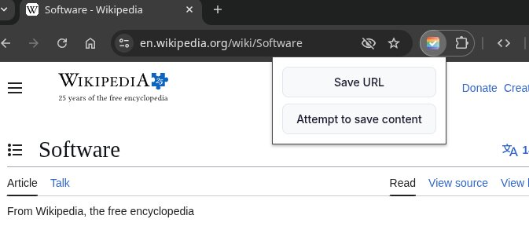

# Lunatask Browser Extension

Save any webpage as a task in [Lunatask](https://lunatask.app) with one click.


## Setup

1. Install the extension
2. Click the extension icon or right-click → "Options"
3. Enter your **Area ID** and **Auth Token** from Lunatask

### Getting your credentials

1. Log in to [Lunatask](https://lunatask.app)
2. Go to **Settings → Integrations → API**
3. Copy your **Auth Token**
4. For the **Area ID**, open the area where you want tasks saved, and copy the ID from the URL: `https://lunatask.app/areas/{area-id}/...`

## Development

```bash
# Install dependencies
npm install

# Build for development (with watch mode)
npm run dev

# Build for production (Chrome/Edge)
npm run build

# Build for Firefox
npm run build:firefox
```

### Load unpacked extension

**Chrome/Edge:** Go to `chrome://extensions`, enable Developer Mode, click "Load unpacked", select the `dist` folder.

**Firefox:** Go to `about:debugging#/runtime/this-firefox`, click "Load Temporary Add-on", select any file in the `dist` folder.

